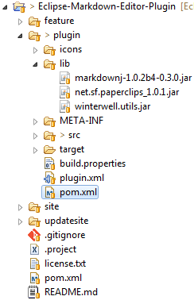

# Eclipse Markdown Editor Plugin

Edit .md and .txt files with syntax highlighting.   
Provides Outline and Preview HTML views.

Please see the website for information:
<http://www.winterwell.com/software/markdown-editor.php>

Eclipse Marketplace entry:
<http://marketplace.eclipse.org/content/markdown-text-editor>  
or install with [Nodeclipse CLI Installer](https://github.com/Nodeclipse/nodeclipse-1/tree/master/org.nodeclipse.ui/templates) `nodeclipse install markdown`

There is also a complementary GitHub Flavoured Markdown Viewer
<https://github.com/satyagraha/gfm_viewer>

## Usage

Note that for HTML preview OS the internal browser is used, e.g. Internet Explorer on Windows; if you use Ubuntu or other Linux distros, we recommend the WebKit browser; see:

- <http://www.eclipse.org/swt/faq.php#browserlinuxrcp>
- <http://www.eclipse.org/swt/faq.php#browserlinux>
- <http://tronprog.blogspot.de/2012/05/eclipse-internal-web-browser-in-kubuntu.html>

## Eclipse Dev Details

You need Eclipse with PDE, e.g. Eclipse Standard

Main Editor class `winterwell.markdown.editors.MarkdownEditor` defined as

      <editor
            name="Markdown Editor"
            extensions="txt,md"
            icon="icons/notepad.gif"
            contributorClass="winterwell.markdown.editors.ActionBarContributor"
            class="winterwell.markdown.editors.MarkdownEditor"
            id="winterwell.markdown.editors.MarkdownEditor">
      </editor>

### Build

	mvn package
      
then check `site\target` directory for update site archive `markdown.editor.site-x.x.x.zip` and p2 repository.
Use Help -> Install New Software... -> Add... -> Archive to istall from .zip file.

Increase version

	mvn -Dtycho.mode=maven org.eclipse.tycho:tycho-versions-plugin:set-version -DnewVersion=1.2.0-SNAPSHOT

### History

- 1.0
- 1.1 (24 Feb 2014) by Telmo Brugnara @tbrugz #40
  - Rich color preferences #35 #37
- 1.2 (Jan 2015) by Olivier Martin @oliviermartin #52
  - Update preview when the file is saved #48
  - MultiMarkdown metadata #49
  - GitHub code blocks #50
  - detecting links #51
  - open GFM View from Markdown View #53

